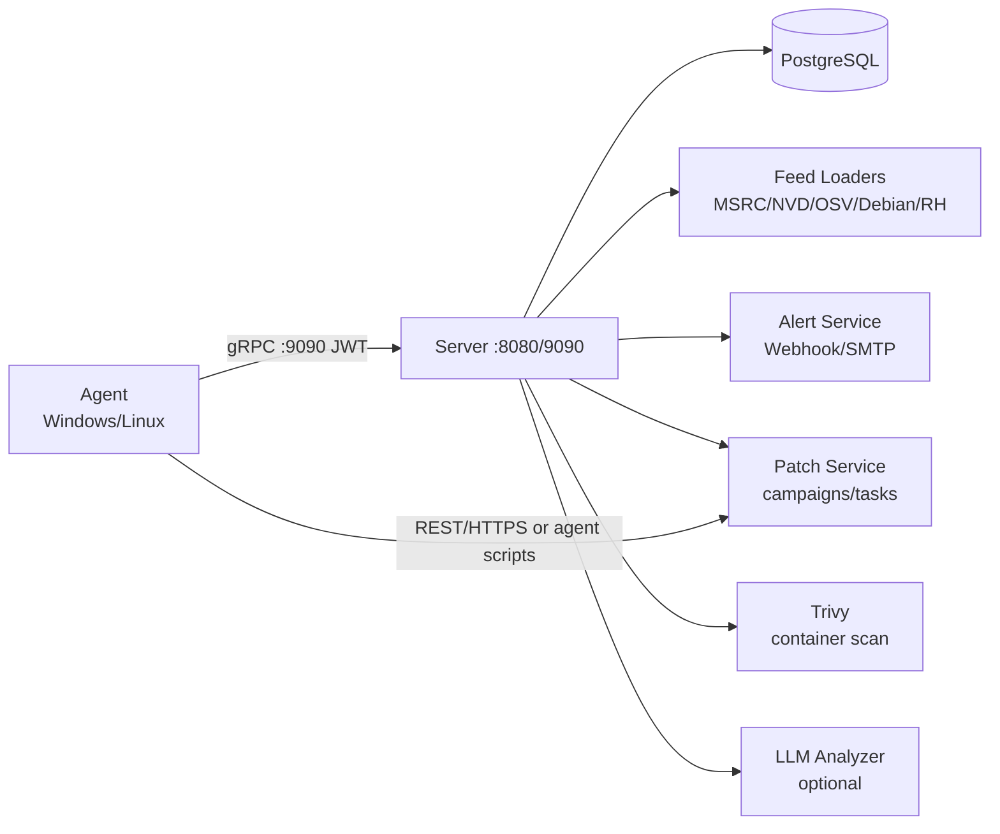

# VulnScanner

[](https://go.dev/dl/)
[](LICENSE)

Server/Agent asset vulnerability scanning & management platform: asset collection (Windows/Linux/SCA) → CVE matching (MSRC/NVD/OSV/Debian) → alerting → patch suggestion & execution → CMDB asset ledger, forming a scan → alert → remediate → deploy closed loop.

Server/Agent 架构的资产漏洞扫描与管理平台：资产采集（Windows/Linux/SCA）→ CVE 匹配（MSRC/NVD/OSV/Debian）→ 告警 → 补丁建议与执行 → CMDB 资产台账，形成扫描-告警-修复-deploy 闭环。

## Features / 功能特性

- **Asset collection / 资产采集** — Windows / Linux host inventory (software, ports, services, processes, hotfixes) with agent auto-registration and token-based auth
- **CVE matching / 漏洞匹配** — deterministic multi-source matching across MSRC, NVD, OSV, Debian Security Tracker, Red Hat Security Data
- **Alerting / 告警** — rule engine with severity/source/agent/asset/tag/environment filters, dedup & cooldown, Webhook (HMAC-signed) / SMTP delivery
- **Patch management / 补丁管理** — server-side whitelisted command templates, approval workflow, execution windows, dry-run rehearsal, batch campaigns & audit trail
- **Container scanning / 容器扫描** — Trivy-based async scanning of local images via Docker socket
- **Risk governance / 风险治理** — dashboard, reports, lifecycle & owner metadata, change history, LLM-assisted analysis (optional)

## Architecture / 架构



| Component / 组件 | Description / 说明 |
| --- | --- |
| `cmd/server` | REST (:8080, X-API-Key auth) + gRPC (:9090, JWT auth) + PostgreSQL |
| `cmd/agent` | Asset collection & reporting, Windows/Linux, installable as system service |
| `internal/store` | Postgres access & migrations (`migrations/*.up.sql`, auto-run at startup, append-only) |
| `internal/cve` | Feed loading & deterministic matching (MSRC/NVD/OSV/Debian/Red Hat) |
| `internal/alert` | Rule evaluation, dedup/cooldown, Webhook/SMTP delivery |
| `internal/patch` | Whitelisted patch command templates & deployment config |
| `internal/collector` | Agent-side inventory collectors (Windows/Linux) |
| `internal/container` | Trivy-based container image scanning |
| `internal/llm` | Optional LLM analysis (OpenAI / Anthropic) |

## Quick Start / 快速开始

**Prerequisites / 前置依赖**

- Go 1.23+
- PostgreSQL 14+
- `protoc` + `protoc-gen-go` + `protoc-gen-go-grpc`（仅首次生成 gRPC 代码时需要；`api/gen/` 已提交，clone 后可直接构建）

```bash
git clone https://github.com/eternallyzzz/vuln-scanner.git
cd vuln-scanner

make proto         # (可选) 重新生成 gRPC 代码
make build         # 构建 bin/server 与 bin/agent

# 配置数据库与密钥（见下节）
# 启动 server
go run ./cmd/server
# agent 端（自动注册并领取任务）
go run ./cmd/agent run
```

## Deployment / 部署

测试/生产环境建议使用 Docker Compose 一键部署（含 PostgreSQL、自动迁移与内置 Agent 安装包），完整说明见
[docs/DEPLOYMENT.md](docs/DEPLOYMENT.md)：

```bash
cd deploy/docker-compose
cp ../../.env.example .env    # 修改 JWT_SECRET / API_KEY / SERVER_URL
docker compose up -d --build
```

Agent 注册/安装脚本基于 `SERVER_URL`（默认 `http://localhost:8080`）生成下载地址，部署在服务器上时必须改为
Agent 可达的对外地址。CI 在 main 分支构建并推送镜像至
`ghcr.io/eternallyzzz/vuln-scanner`（`latest` 与 `sha-<commit>` 标签）。

## Configuration / 配置

### Server (`server.yaml`)

```yaml
alerting:
  enabled: true
  webhook_url: "https://hooks.example.com/x"
  webhook_secret: "hmac-secret"
  smtp: { host: "", port: 587, user: "", password_env: SMTP_PASSWORD, from: "", to: [] }
  delivery_interval_seconds: 30
  max_attempts: 3
patch:
  enabled: true
  default_approval_required: true
  agent_timeout_seconds: 600
  apt_command: "apt-get install -y --only-upgrade"
  dry_run: true   # true=只记录不执行，上线前先演练
  auto_remediation:
    enabled: true          # 新告警命中 auto_remediate 规则时自动生成补丁 campaign
    approval_required: true
    min_severity: HIGH
    max_campaigns_per_hour: 50

container_scan:
  enabled: true
  docker_host: "unix:///var/run/docker.sock"
  images: []               # 空 = 扫描全部本地镜像；可显式列出 repo:tag
  image_filter: ""         # 可选正则过滤镜像
  exclude: ["kicbase", "docker-desktop"]
  trivy_image: "aquasec/trivy:latest"
  trivy_cache_volume: "vulnscan-trivy-cache"
  agent_id: "agent-container-docker"
  scan_interval_minutes: 360
  timeout_minutes: 20
  max_images: 100
```

### Agent (`~/.vuln-scanner/agent.yaml`)

Set `agent.patch_enabled: true` to enable patch task polling / 开启补丁任务轮询。

## API Keys & Secrets / 密钥配置

The repository contains **no hardcoded API keys**; every deployer supplies their own. / 仓库不含任何硬编码密钥，由每个部署者自行提供：

| Secret / 密钥 | Source / 来源 | Notes / 说明 |
| --- | --- | --- |
| `NVD_API_KEY` | env var, or `cve.nvd_api_key` in `server.yaml` | Optional. Without it NVD is still usable at 2 req/s; with it, 0.6 req/s. 免费申请：https://nvd.nist.gov/developers/request-an-api-key |
| `OPENAI_API_KEY` / `ANTHROPIC_API_KEY` | `llm.api_key` in `server.yaml` | Optional, for LLM analysis |
| `SMTP_PASSWORD` | `alerting.smtp.password_env` | SMTP password for alert delivery |
| `JWT_SECRET` / `API_KEY` | `server.yaml` | Agent gRPC JWT signing secret & REST X-API-Key. **Must be changed** from the demo placeholders |
| OSV / MSRC / Debian / Red Hat | none / 无 | Public APIs, no key required |

**Key expansion / 变量展开** — `server.yaml` values support `${ENV}` expansion, e.g. `api_key: "${API_KEY}"`, `nvd_api_key: "${NVD_API_KEY}"`. Values are resolved from the server process environment (`os.ExpandEnv`). For a complete template see [`.env.example`](.env.example) (note: the server does **not** auto-load a `.env` file; export variables into the service environment instead, or pass them to `make run-server`).

`server.yaml` 中的密钥字段支持 `${ENV}` 展开（从进程环境读取，见 `.env.example` 模板；服务器不自动加载 `.env` 文件，请将变量导出到服务环境）。

## Core APIs / 核心 API

- 资产：`GET/PUT /api/v1/assets...`（筛选、标签/环境/负责人、生命周期、变更历史、关系、summary）
- 告警：`/api/v1/alert-rules` CRUD、`/api/v1/alerts` 查询/ack/resolve/remediate、`test` 通道测试；规则支持 severity/source/agent/asset/tag/environment/min_cvss/cooldown，`auto_remediate: true` 时新告警自动生成补丁 campaign（告警上回填 remediation_campaign_id）
- 补丁：`POST /agents/{id}/patch-tasks/generate`、`/patch-tasks/{id}/approve|reject|cancel|retry`；agent 轮询执行并回传结果
- 批量补丁：`POST /api/v1/patch-campaigns`（按 agent_ids/tags/environments/asset_names/cve_ids/min_severity/min_cvss 批量生成，支持 `dry_run` 预演、重复任务去重）、`/patch-campaigns/{id}/approve|reject|cancel|retry` 批量状态流转、`/patch-campaigns/{id}` 汇总与审计、`GET /api/v1/patch-tasks` 全局任务列表
- 容器扫描：`POST /api/v1/container/scan` 异步触发 Trivy 扫描、`GET /api/v1/container/status` 扫描状态、`GET /api/v1/container/images` 镜像清单；结果落入合成 agent（默认 agent-container-docker），修复建议为 rebuild（不可自动部署）
- 资产元数据：`POST /api/v1/assets/bulk-meta` 批量维护 tags/environment/business_unit/owner/lifecycle
- 扫描：`/api/v1/scan-policies`、`POST /agents/{id}/scan`
- 漏洞：`/agents/{id}/vulns`、`/recommendations`、`/report`、`/dashboard`、`/search`、`/stats`

## Users & RBAC / 用户与权限

服务端提供控制台用户体系（`users` 表）与基于角色的访问控制，覆盖全部 REST API：

| 角色 | 权限 |
| --- | --- |
| `admin` | 全部操作，含 `/admin/*` 数据源刷新、用户管理、agent 创建/删除 |
| `operator` | 日常运维：补丁任务/campaign 审批流转、告警 ack/resolve/remediate、异常创建/撤销、触发扫描/分析、资产导入与元数据、alert-rules 与 SLA 策略维护 |
| `viewer` | 只读（所有 GET） |

- 登录：`POST /api/v1/auth/login`（`{username, password}`）返回 12 小时有效的 JWT（复用 `JWT_SECRET`，与 agent token 隔离）；`GET /api/v1/auth/me` 查看当前用户；`POST /api/v1/auth/change-password` 修改本人密码。
- 用户管理（admin）：`GET/POST /api/v1/users`、`PUT/DELETE /api/v1/users/{id}`、`POST /api/v1/users/{id}/password`；禁止删除/降级最后一个 active admin。
- 首启引导：`users` 表为空且设置 `ADMIN_PASSWORD` 环境变量时自动创建第一个 `admin` 用户（用户名默认 `admin`，可用 `ADMIN_USERNAME` 覆盖）；未设置则控制台登录不可用。
- 兼容性：`X-API-Key` 继续作为 admin 级自动化凭证；请求带用户 Bearer token 时优先按用户角色鉴权。禁用用户只阻止新登录，已签发 token 到期前仍有效。

## Security Model / 安全模型

- 补丁命令由服务端白名单模板生成（apt argv 数组 / 受限 PowerShell 脚本），资产名与 URL 均校验，杜绝自由 shell 输入
- 任务默认需审批，且受执行窗口约束；agent 仅领取 approved 且在窗口内的任务
- 执行结果（exit_code/output/时间）与审批人全部落库审计；`dry_run` 可安全演练
- 告警投递带 HMAC-SHA256 签名，投递失败最多重试 3 次并留痕
- Agent 通过 gRPC JWT 鉴权；REST 使用 X-API-Key

## Project Layout / 目录结构

```
cmd/server cmd/agent   # 入口
internal/
  store                # PostgreSQL 访问与迁移
  cve                  # 数据源加载与匹配 (api/gen 由 api/proto 生成)
  alert patch          # 告警 / 补丁
  collector container  # 采集 / 容器扫描
  llm server agent     # LLM / 服务 / Agent
api/proto api/gen      # protobuf 源与生成代码
deploy/                # docker-compose / k8s / 脚本
```

## Development / 开发

| Command / 命令 | Description / 说明 |
| --- | --- |
| `make proto` | 重新生成 gRPC 代码（需 protoc + protoc-gen-go） |
| `make build` | 构建 server/agent |
| `make test` | 单测（`-race`） |
| `make lint` | golangci-lint |
| `make migrate-up / migrate-down` | 数据库迁移 |
| `make run-server / run-agent` | 本地运行 |
| `go run ./cmd/server` | 本地运行（依赖 PostgreSQL） |

## Data Sources & Limitations / 数据源与已知限制

- CVE 数据源：MSRC、NVD、OSV（Debian/Alpine/Ubuntu/AlmaLinux/Rocky Linux/SUSE/Red Hat 及语言生态）、Debian Security Tracker、Red Hat Security Data（列表 + per-CVE package_state 详情）。
- Ubuntu 主机通过 OSV 官方记录覆盖 CVE/USN/LSN，生态名按版本映射（如 `Ubuntu:22.04:LTS`）。
- Red Hat package_state 的未修复状态（Affected / Will not fix / Fix deferred / Under investigation）只对真实 RHEL agent 生效；AlmaLinux/Rocky/CentOS 不继承该判定，避免误报。
- CentOS Stream 与 Fedora：OSV 无覆盖（生态列表与数据目录均无），CentOS Stream 保持显式跳过 RHEL 数据匹配，Fedora 无专门数据源；Arch 不支持。

## License / 许可证

[MIT](LICENSE) — Copyright (c) 2026 eternallyzzz
