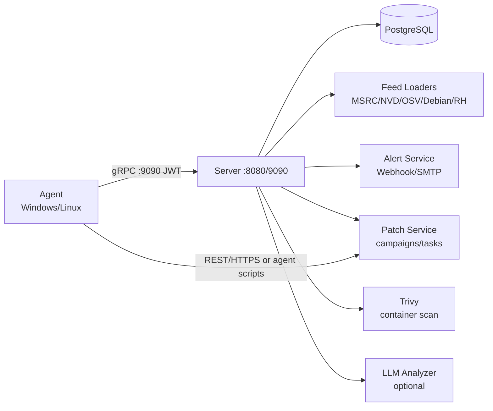

# VulnScanner

[](https://go.dev/dl/)
[](LICENSE)

Server/Agent asset vulnerability scanning & management platform: asset collection (Windows/Linux/SCA) → CVE matching (MSRC/NVD/OSV/Debian) → alerting → patch suggestion & execution → CMDB asset ledger, forming a scan → alert → remediate → deploy closed loop.

Server/Agent 架构的资产漏洞扫描与管理平台：资产采集（Windows/Linux/SCA）→ CVE 匹配（MSRC/NVD/OSV/Debian）→ 告警 → 补丁建议与执行 → CMDB 资产台账，形成扫描-告警-修复-deploy 闭环。

## Features / 功能特性

- **Asset collection / 资产采集** — Windows / Linux host inventory (software, ports, services, processes, hotfixes) with agent auto-registration and token-based auth
- **CVE matching / 漏洞匹配** — deterministic multi-source matching across MSRC, NVD, OSV, Debian Security Tracker, Red Hat Security Data
- **Alerting / 告警** — rule engine with severity/source/agent/asset/tag/environment filters, dedup & cooldown, Webhook (HMAC-signed) / SMTP delivery
- **Ticketing integration / 工单集成** — alert rules with `ticket_enabled: true` auto-create Jira issues / ServiceNow incidents; ack/resolved sync back the ticket status with automatic retry and a manual retry endpoint
- **SIEM/SOAR event stream / 安全事件流** — alert and patch-task state changes are written to an outbox and delivered to Splunk HEC / generic Webhook with retries
- **Cloud asset discovery / 云资产接入** — AWS EC2/S3/RDS, Azure VM/Storage/SQL, GCP instance/GCS/Cloud SQL discovery with encrypted account credentials, periodic refresh and CMDB sync
- **Patch management / 补丁管理** — server-side whitelisted command templates, approval workflow, execution windows, dry-run rehearsal, batch campaigns & audit trail
- **Container scanning / 容器扫描** — Trivy-based async scanning of local images via Docker socket
- **Network scanning / 网络扫描** — Agent-side TCP discovery & service fingerprint (no credentials), results feed the existing CVE matching / risk / alerting pipeline
- **Remote credential scanning / 凭据远程扫描** — Server-side SSH collection (Linux/macOS/Windows OpenSSH) with encrypted credential store, ToFU host-key verification and full audit; agent-first, credential scan as the fallback
- **Web/DB scanning / Web 应用与数据库扫描** — Server-side HTTP(S) fingerprint (nginx/apache/IIS/Tomcat/PHP/WordPress etc.) and PostgreSQL/MySQL/Redis version identification with optional encrypted credentials; results feed the existing CVE matching / risk / alerting pipeline and CMDB
- **Proprietary threat intel / 专有威胁情报** — built-in vulnerability fingerprint rules (product + version range + fixed version) and CVE annotations (threat level / exploited / notes) maintained as migration seeds; rules auto-load into matching at startup, annotations raise the risk floor on recalculation, read-only APIs, zero runtime maintenance
- **EOL detection / 停更检测** — OS / 发行版生命周期判定（eol/unsupported/supported），纳入风险评分、风险汇总/TOP/CSV 导出
- **Compliance baseline / 合规基线** — Agent 侧 CIS 风格精简基线（Windows/Linux 各 10 项配置检查）与合规评分，提供汇总/明细/CSV 导出并纳入日报概览
- **Risk governance / 风险治理** — dashboard, reports, lifecycle & owner metadata, change history, LLM-assisted analysis (optional)

## Architecture / 架构



| Component / 组件 | Description / 说明 |
| --- | --- |
| `cmd/server` | REST (:8080, X-API-Key auth) + gRPC (:9090, JWT auth) + PostgreSQL |
| `cmd/agent` | Asset collection & reporting, Windows/Linux, installable as system service |
| `internal/store` | Postgres access & migrations (`migrations/*.up.sql`, auto-run at startup, append-only) |
| `internal/cve` | Feed loading & deterministic matching (MSRC/NVD/OSV/Debian/Red Hat) |
| `internal/alert` | Rule evaluation, dedup/cooldown, Webhook/SMTP delivery |
| `internal/patch` | Whitelisted patch command templates & deployment config |
| `internal/collector` | Agent-side inventory collectors (Windows/Linux) |
| `internal/container` | Trivy-based container image scanning |
| `internal/remotescan` | Server-side SSH credential scanning (Linux/macOS/Windows), encrypted credential store & ToFU host keys |
| `internal/ticket` | Jira/ServiceNow integration: alert-driven ticket creation and status sync |
| `internal/siem` | SIEM/SOAR outbox: Splunk HEC / generic Webhook delivery of alert & patch events |
| `internal/cloudscan` | AWS/Azure/GCP discovery clients for cloud asset inventory |
| `internal/webdbscan` | Server-side HTTP fingerprint & PostgreSQL/MySQL/Redis version probing with optional encrypted credentials |
| `internal/llm` | Optional LLM analysis (OpenAI / Anthropic) |

## Quick Start / 快速开始

**Prerequisites / 前置依赖**

- Go 1.23+
- PostgreSQL 14+
- `protoc` + `protoc-gen-go` + `protoc-gen-go-grpc`（仅首次生成 gRPC 代码时需要；`api/gen/` 已提交，clone 后可直接构建）

```bash
git clone https://github.com/eternallyzzz/vuln-scanner.git
cd vuln-scanner

make proto         # (可选) 重新生成 gRPC 代码
make build         # 构建 bin/server 与 bin/agent

# 配置数据库与密钥（见下节）
# 启动 server
go run ./cmd/server
# agent 端（自动注册并领取任务）
go run ./cmd/agent run
```

## Deployment / 部署

测试/生产环境建议使用 Docker Compose 一键部署（含 PostgreSQL、自动迁移与内置 Agent 安装包），完整说明见
[docs/DEPLOYMENT.md](docs/DEPLOYMENT.md)：

```bash
cd deploy/docker-compose
cp ../../.env.example .env    # 修改 JWT_SECRET / API_KEY / SERVER_URL
docker compose up -d --build
```

Agent 注册/安装脚本基于 `SERVER_URL`（默认 `http://localhost:8080`）生成下载地址，部署在服务器上时必须改为
Agent 可达的对外地址。CI 在 main 分支构建并推送镜像至
`ghcr.io/eternallyzzz/vuln-scanner`（`latest` 与 `sha-<commit>` 标签）。

## Configuration / 配置

### Server (`server.yaml`)

```yaml
alerting:
  enabled: true
  webhook_url: "https://hooks.example.com/x"
  webhook_secret: "hmac-secret"
  smtp: { host: "", port: 587, user: "", password_env: SMTP_PASSWORD, from: "", to: [] }
  delivery_interval_seconds: 30
  max_attempts: 3
patch:
  enabled: true
  default_approval_required: true
  agent_timeout_seconds: 600
  apt_command: "apt-get install -y --only-upgrade"
  dry_run: true   # true=只记录不执行，上线前先演练
  auto_remediation:
    enabled: true          # 新告警命中 auto_remediate 规则时自动生成补丁 campaign
    approval_required: true
    min_severity: HIGH
    max_campaigns_per_hour: 50

reporting:
  enabled: true
  schedule: "0 8 * * *"    # 标准 5 段 cron，默认每天 08:00
  timezone: "Local"        # 默认 Local；例如 "Asia/Shanghai"
  to: ["ops@example.com"]  # 收件人独立；SMTP 服务器/认证复用 alerting.smtp

container_scan:
  enabled: true
  docker_host: "unix:///var/run/docker.sock"
  images: []               # 空 = 扫描全部本地镜像；可显式列出 repo:tag
  image_filter: ""         # 可选正则过滤镜像
  exclude: ["kicbase", "docker-desktop"]
  trivy_image: "aquasec/trivy:latest"
  trivy_cache_volume: "vulnscan-trivy-cache"
  agent_id: "agent-container-docker"
  scan_interval_minutes: 360
  timeout_minutes: 20
  max_images: 100

ldap:                    # 可选；不配置或 enabled: false 时 LDAP 登录端点返回 400
  enabled: true
  url: "ldap://ldap.example.com:389"   # 支持 ldap:// 与 ldaps://
  tls_skip_verify: false               # 仅对 ldaps:// 生效，测试环境可临时 true
  bind_dn: "cn=admin,dc=example,dc=org"
  bind_password_env: "LDAP_BIND_PASSWORD"   # 密码只从环境变量读取，不写入配置文件
  user_base_dn: "ou=users,dc=example,dc=org"
  user_filter: "(uid={username})"      # 支持 {username} 占位符
  group_base_dn: "ou=groups,dc=example,dc=org"
  group_filter: "(member={dn})"        # 支持 {dn} 占位符
  role_groups:                         # 组可写 DN 或 CN，匹配不区分大小写
    admin: ["cn=admins,ou=groups,dc=example,dc=org"]
    operator: ["cn=ops,ou=groups,dc=example,dc=org"]
    viewer: ["viewers"]
  auto_provision: true                 # true=首次登录自动建号；false=仅允许已有本地用户
  timeout_seconds: 10
```

### Server：工单集成（可选）

`alerting.enabled` 必须为 true；`ticketing.enabled` 后，命中 `ticket_enabled: true` 规则的新告警自动建单，
本地 ack/resolved 时后台同步工单状态（失败自动重试 3 次，可 `POST /api/v1/alerts/{id}/ticket/retry` 手动重试）。

```yaml
ticketing:
  enabled: true
  provider: "jira"                        # jira | servicenow
  base_url: "https://jira.example.com"
  username: "svc-vulnscan@example.com"
  password_env: "TICKET_PASSWORD"         # 密码只从环境变量读取，不写入配置文件
  timeout_seconds: 15
  tls_skip_verify: false
  # Jira
  project: "SEC"
  issue_type: "Task"
  jira_ack_transition_id: ""              # 留空则 ack 仅添加评论
  jira_resolved_transition_id: ""         # 留空则 resolved 仅添加评论
  # ServiceNow
  servicenow_table: "incident"
  servicenow_ack_state: 2
  servicenow_resolved_state: 6
```

### Server：SIEM/SOAR 事件流（可选）

告警（created/acknowledged/resolved）与补丁任务状态变化会先写入 outbox，再由后台 worker 批量投递；
默认 10 秒轮询、单批 50 条、失败重试 3 次。Splunk HEC 与 Webhook 可同时启用，token/secret 只从环境变量读取。

```yaml
siem:
  enabled: true
  splunk_hec:
    url: "https://splunk.example.com:8088/services/collector/event"
    token_env: "SIEM_SPLUNK_HEC_TOKEN"
    index: "vulnscan"
    sourcetype: "vulnscan:events"
  webhook:
    url: "https://soar.example.com/hook"
    secret_env: "SIEM_WEBHOOK_SECRET"   # 可选；配置后请求带 HMAC 签名
  delivery_interval_seconds: 10
  batch_size: 50
  max_attempts: 3
  timeout_seconds: 10
  tls_skip_verify: false
```

### Server：云资产接入（可选）

云账号凭据 AES-256-GCM 加密落库（主密钥仅从环境变量读取），支持多账号、启停、手动/周期刷新；
发现的 EC2/S3/RDS、Azure VM/存储/SQL、GCP 实例/GCS/Cloud SQL 会同步到 CMDB 资产台账。

```yaml
cloud_scan:
  enabled: true
  master_key_env: "CLOUD_SCAN_MASTER_KEY"   # AES-256 主密钥（hex/base64 32 字节），只从环境变量读取
  concurrency: 2
  default_refresh_interval_minutes: 60
  timeout_seconds: 30
```

### Server：凭据远程扫描（可选）

启用后服务端可用保存的 SSH 凭据直连目标（Linux/macOS/Windows OpenSSH）做只读采集
（OS/内核/包列表/热补丁），结果生成合成 agent 并进入现有 CVE 匹配/风险/告警链路。
凭据以 AES-256-GCM 加密落库，主密钥只从环境变量读取；host key 采用首次使用即信任（ToFU）。
建议优先引导对方安装 Agent；确需凭据时优先使用平台生成的密钥对（对方只安装公钥）。

```yaml
remote_scan:
  enabled: true
  master_key_env: "REMOTE_SCAN_MASTER_KEY"   # AES-256 密钥（hex/base64 32 字节），只从环境变量读取
  timeout_seconds: 30
  concurrency: 8
```

### Server：Web 应用与数据库扫描（可选）

服务端对 HTTP(S) 应用做首页指纹识别（Server/X-Powered-By/meta generator/页面 hint，识别
nginx/apache/IIS/Tomcat/PHP/WordPress 等），并对 PostgreSQL/MySQL/Redis 做版本识别；
MySQL/Redis 无需凭据即可识别版本，PostgreSQL 需凭据（也可先只记录“可达且需要认证”）。
凭据（HTTP Basic Auth / 数据库登录）以 AES-256-GCM 加密落库，主密钥只从环境变量读取；
结果生成合成 agent（agent-web-*/agent-db-*）并进入现有 CVE 匹配/风险/告警/CMDB 链路。

```yaml
webdb_scan:
  enabled: true
  master_key_env: "WEBDB_SCAN_MASTER_KEY"    # AES-256 主密钥（hex/base64 32 字节），只从环境变量读取
  timeout_seconds: 10
  concurrency: 8
  tls_skip_verify: true                       # 内网自签证书场景建议 true
```

### Agent (`~/.vuln-scanner/agent.yaml`)

Set `agent.patch_enabled: true` to enable patch task polling / 开启补丁任务轮询。

网络扫描（可选）：启用后 Agent 按周期对目标网段做 TCP 发现与服务指纹，结果上报 Server 并进入
现有 CVE 匹配/风险/告警链路；也可由 Server 通过 `POST /api/v1/network/scan` 下发一次性任务。

```yaml
network_scan:
  enabled: true
  interval_minutes: 60
  targets:
    - "192.168.10.0/24"
  ports: [21, 22, 80, 443, 445, 3389, 5432, 6379, 8080]   # 不填用默认端口表
  exclude: ["192.168.10.99"]
  timeout_seconds: 2
  concurrency: 32
  max_hosts: 1024
```

EDR 恶意软件发现与补丁运行时验证（可选）：

```yaml
edr_scan:
  enabled: false          # 默认关闭；开启后仅在全量同步时执行一次 clamscan
  paths:                  # 待扫描路径，由部署方配置
    - "/var/www"
    - "/tmp"
  timeout_seconds: 120
```

开启后 Agent 在存在 `clamscan` 二进制的 Linux/macOS 上执行
`clamscan --infected --no-summary`，解析 `path: VirusName FOUND` 行并随全量
SystemInfo 上报（`source=clamav`，Windows 本轮不扫描）。补丁任务成功后 Agent
还会在 60s 轮询中领取 `runtime_verify_status=pending` 的任务，上报当前
SystemInfo 快照做运行时验证（基线服务必须仍 running、与资产同名的进程必须
仍存在）；无基线时结果为 `na`。operator 也可用
`POST /api/v1/patch-tasks/{taskId}/verify` 手动触发并用最新快照立即评估。

## API Keys & Secrets / 密钥配置

The repository contains **no hardcoded API keys**; every deployer supplies their own. / 仓库不含任何硬编码密钥，由每个部署者自行提供：

| Secret / 密钥 | Source / 来源 | Notes / 说明 |
| --- | --- | --- |
| `NVD_API_KEY` | env var, or `cve.nvd_api_key` in `server.yaml` | Optional. Without it NVD is still usable at 2 req/s; with it, 0.6 req/s. 免费申请：https://nvd.nist.gov/developers/request-an-api-key |
| `OPENAI_API_KEY` / `ANTHROPIC_API_KEY` | `llm.api_key` in `server.yaml` | Optional, for LLM analysis |
| `SMTP_PASSWORD` | `alerting.smtp.password_env` | SMTP password for alert delivery |
| `LDAP_BIND_PASSWORD` | `ldap.bind_password_env` | LDAP service-account bind password; read from the environment variable named there (env-only deployments can set `LDAP_BIND_PASSWORD` directly) |
| `REMOTE_SCAN_MASTER_KEY` | `remote_scan.master_key_env` | AES-256 master key (hex/base64 32 bytes) for encrypted remote credentials; read from the environment variable named there, never write it to server.yaml |
| `TICKET_PASSWORD` | `ticketing.password_env` | Jira API token / ServiceNow password for ticket integration; read from the environment variable named there, never write it to server.yaml |
| `SIEM_SPLUNK_HEC_TOKEN` / `SIEM_WEBHOOK_SECRET` | `siem.splunk_hec.token_env` / `siem.webhook.secret_env` | Splunk HEC token / webhook signing secret for the event stream; read from the environment variables named there, never write them to server.yaml |
| `CLOUD_SCAN_MASTER_KEY` | `cloud_scan.master_key_env` | AES-256 master key (hex/base64 32 bytes) for encrypting cloud account credentials; read from the environment variable named there, never write it to server.yaml |
| `WEBDB_SCAN_MASTER_KEY` | `webdb_scan.master_key_env` | AES-256 master key (hex/base64 32 bytes) for encrypting optional web/database scan credentials; read from the environment variable named there, never write it to server.yaml |
| `JWT_SECRET` / `API_KEY` | `server.yaml` | Agent gRPC JWT signing secret & REST X-API-Key. **Must be changed** from the demo placeholders |
| OSV / MSRC / Debian / Red Hat | none / 无 | Public APIs, no key required |

**Key expansion / 变量展开** — `server.yaml` values support `${ENV}` expansion, e.g. `api_key: "${API_KEY}"`, `nvd_api_key: "${NVD_API_KEY}"`. Values are resolved from the server process environment (`os.ExpandEnv`). For a complete template see [`.env.example`](.env.example) (note: the server does **not** auto-load a `.env` file; export variables into the service environment instead, or pass them to `make run-server`).

`server.yaml` 中的密钥字段支持 `${ENV}` 展开（从进程环境读取，见 `.env.example` 模板；服务器不自动加载 `.env` 文件，请将变量导出到服务环境）。

## Core APIs / 核心 API

- 资产：`GET/PUT /api/v1/assets...`（筛选、标签/环境/负责人、生命周期、变更历史、关系、summary）
- 告警：`/api/v1/alert-rules` CRUD、`/api/v1/alerts` 查询/ack/resolve/remediate、`test` 通道测试；规则支持 severity/source/agent/asset/tag/environment/min_cvss/cooldown，`auto_remediate: true` 时新告警自动生成补丁 campaign（告警上回填 remediation_campaign_id）
- 工单集成：`ticket_enabled: true` 的规则命中后自动在 Jira/ServiceNow 建单，`GET /alerts` 返回 ticket_key/url；`POST /api/v1/alerts/{id}/ticket/retry`（operator+）可手动重试建单/状态同步
- 安全事件流：告警与补丁任务状态变化经 `siem_events` outbox 投递到 Splunk HEC / 通用 Webhook（`siem.enabled: true` 时启用，失败自动重试）
- 云资产接入：`/api/v1/cloud/accounts`（admin 管理加密云账号）、`POST /api/v1/cloud/accounts/{id}/refresh`（operator+ 手动刷新）、`GET /api/v1/cloud/resources` 与 CSV 导出（viewer+）；周期刷新由 `cloud_scan` 配置驱动
- 补丁：`POST /agents/{id}/patch-tasks/generate`、`/patch-tasks/{id}/approve|reject|cancel|retry|stop`；agent 轮询执行并回传结果，执行期间 stdout/stderr 通过 `GET /patch-tasks/{id}/events` 游标轮询实时查看，`POST /patch-tasks/{id}/stop` 可中止运行中任务（agent 终止进程树后上报 cancelled）
- 补丁运行时验证：任务成功后进入 `runtime_verify_status=pending`，agent 在 60s 轮询上报 SystemInfo 快照，服务/进程基线检查结果写入任务（passed/failed/na）并追加 `patch_task.verified` 事件；`POST /api/v1/patch-tasks/{id}/verify`（operator+）可手动触发并用最新快照立即评估
- EDR 联动：`POST /api/v1/edr/findings`（operator+，agent_id 或 hostname，幂等 upsert，去重键=agent+source+hash 否则 name）上报恶意软件发现；`GET /api/v1/edr/findings` 与 `/{id}` 查询，`POST /{id}/ack|ignore|resolve` 处置并同步联动告警；HIGH/CRITICAL 自动经内置 `edr-malware` 规则生成/刷新 open 告警（cve_id 置空、edr_finding_id 关联），复用现有工单/SIEM 链路；agent 可选 ClamAV 采集（`edr_scan` 配置，默认关闭）
- 批量补丁：`POST /api/v1/patch-campaigns`（按 agent_ids/tags/environments/asset_names/cve_ids/min_severity/min_cvss 批量生成，支持 `dry_run` 预演、重复任务去重）、`/patch-campaigns/{id}/approve|reject|cancel|retry` 批量状态流转、`/patch-campaigns/{id}` 汇总与审计、`GET /api/v1/patch-tasks` 全局任务列表
- 容器扫描：`POST /api/v1/container/scan` 异步触发 Trivy 扫描、`GET /api/v1/container/status` 扫描状态、`GET /api/v1/container/images` 镜像清单；结果落入合成 agent（默认 agent-container-docker），修复建议为 rebuild（不可自动部署）
- 网络扫描：`GET /api/v1/network/hosts`（发现主机与服务指纹）、`GET /api/v1/network/tasks`（任务列表）、`POST /api/v1/network/scan`（operator+ 下发一次性任务，Agent 领取执行）；每台主机生成合成 agent（agent-net-*）复用匹配/风险/告警链路
- 凭据远程扫描：`POST /api/v1/remote/credentials`（admin 创建 password/key 凭据；key 不传私钥时服务端生成并一次性返回公钥）、`GET/PUT/DELETE /api/v1/remote/credentials[/{id}]`（admin，软删除）、`POST /api/v1/remote/scan`（operator+ 下发 Server 直连 SSH 任务）、`GET /api/v1/remote/tasks`、`GET /api/v1/remote/hosts`（viewer+）；凭据加密落库，host key ToFU，任务结束写审计
- Web/数据库扫描：`POST /api/v1/webdb/scan`（operator+ 下发一次性 web/db 任务，body 含 `web: [URL...]` 与 `db: [{target, db_type, credential_id?}]`）、`GET /api/v1/webdb/tasks`、`GET /api/v1/webdb/targets`（viewer+）；凭据 CRUD 仅 admin 且响应不含密文；MySQL/Redis 无凭据识别版本，PostgreSQL 需凭据；结果生成 agent-web-*/agent-db-* 合成 agent
- 专有威胁情报：`GET /api/v1/intel/rules`（viewer+，只读）查看内置漏洞指纹规则；规则由迁移种子维护（代码即数据），启动自动镜像进匹配管线（`source=custom`），命中进入 CVE 结果/风险/告警
- 专有威胁情报：`GET /api/v1/intel/annotations`（viewer+，只读）查看 CVE 情报标注（威胁级别/已利用/备注）；标注同样由迁移种子维护，服务启动或风险重算时自动生效，`exploited` 或 `CRITICAL` 等威胁级别按“风险下限”抬高风险评分并写入 CVE 结果/告警
- 专有威胁情报：标注三列同步进入风险面——`GET /api/v1/risk/top`、`GET /api/v1/risk/export.csv` 与每日日报（HTML 表格 + CSV 附件）均带 `intel_threat_level/intel_exploited/intel_notes`
- 资产元数据：`POST /api/v1/assets/bulk-meta` 批量维护 tags/environment/business_unit/owner/lifecycle
- 扫描：`/api/v1/scan-policies`、`POST /agents/{id}/scan`
- 漏洞：`/agents/{id}/vulns`、`/recommendations`、`/report`、`/dashboard`、`/search`、`/stats`
- EOL：`GET /api/v1/eol/summary`、`GET /api/v1/eol/agents`、`POST /api/v1/admin/refresh-eol`（管理员手动重算，服务端默认每 6 小时自动刷新）；生命周期数据基于公开资料静态种子表（`os_lifecycle`），日期以厂商为准
- 审计日志：`GET /api/v1/audit-logs`（admin，支持 `actor/method/path/since/until/limit/offset`，返回 `total + entries`）、`GET /api/v1/audit-logs/export.csv`（admin，最新 5000 条）；所有 `POST/PUT/DELETE/PATCH` 自动记录操作人、方法、路径、状态码、来源 IP 与耗时，登录成功/失败亦入审计
- 计划报表：配置 `reporting.*` 后服务端按 cron 自动生成全景日报（HTML 邮件正文 + CSV 附件，SMTP 复用 `alerting.smtp`）；`POST /api/v1/admin/report/send`（admin）可手动立即发送
- 合规基线：Agent 侧执行 CIS 风格精简检查（v1 为双平台各 10 项，非官方认证）并自动上报；`GET /api/v1/compliance/summary`（fleet 平均分、最低/最高分、失败检查 Top）、`GET /api/v1/compliance/agents`（每 agent 评分行）、`GET /api/v1/compliance/agents/{id}`（检查明细）、`GET /api/v1/compliance/export.csv`；所有登录角色可读，日报 HTML 含合规概览
- OpenAPI 规范：`GET /openapi.yaml`（免鉴权）返回完整 OpenAPI 3.0.3 规范，覆盖全部 REST 端点、鉴权方案与 `x-roles` 角色标注；人类阅读版见 [docs/API.md](docs/API.md)

## 扩展内置情报 / Adding Built-in Intel

专有威胁情报坚持“零维护、只有代码”：规则数据存放在 `internal/store/migrations/*.up.sql`
的 `custom_intel` 种子中，新增或修改规则 = 追加/修改迁移并提交代码；服务每次启动会把
`enabled=true` 的规则镜像到 `cve_feed`（`source=custom`）并参与现有名称/版本范围/修复版本匹配。
`affected` 字段与公共 feed 同一结构（name/vendor/min_ver/max_ver/边界/fixed_in/cpe/ecosystem），
可用 `CUSTOM-*` 独立 ID 避免与公共 CVE 去重冲突。规则条目带 `cpe` 时按 CPE 产品+版本严格匹配
（`cpe:2.3:...` 与 `cpe:/...` 两种格式均支持），不带 `cpe` 时回退名称匹配；版本范围
`min_ver/max_ver/fixed_in` 语义与公共 feed 一致。不提供后台增删改/导入接口。

CVE 情报标注（`cve_intel_annotations`）与规则同一思路：每条 CVE 一条标注
（cve_id 唯一，`threat_level/exploited/notes`），种子内置 4 条真实 CVE
（CVE-2021-44228 Log4Shell、CVE-2017-0144 EternalBlue、CVE-2023-34362 MOVEit、
CVE-2024-3400 PAN-OS，均为 exploited + CRITICAL）。标注在 `RecalcAgentRisk`
叠加“风险下限”：exploited 或 CRITICAL → 9.0、HIGH → 7.0、MEDIUM → 5.0、
LOW → 0（取 max，封顶 10），不改变 `RiskScore` 公式与既有 EPSS/KEV 行为；
命中行把 `intel_threat_level/intel_exploited/intel_notes` 写回 CVE 结果，
告警复制 exploited/threat_level 两列。无标注的 CVE 行为完全不变；新增/修改
标注 = 提交迁移，零运维、无热更新接口。RiskTop/CSV/日报与 CVE 详情一样展示
威胁级别/已利用/备注三列，便于治理视图直接看到“官方已利用”与处置提示。

## Users & RBAC / 用户与权限

服务端提供控制台用户体系（`users` 表）与基于角色的访问控制，覆盖全部 REST API：

| 角色 | 权限 |
| --- | --- |
| `admin` | 全部操作，含 `/admin/*` 数据源刷新、用户管理、agent 创建/删除、审计日志查询与 CSV 导出、计划报表手动发送 |
| `operator` | 日常运维：补丁任务/campaign 审批流转、告警 ack/resolve/remediate、异常创建/撤销、触发扫描/分析、资产导入与元数据、alert-rules 与 SLA 策略维护 |
| `viewer` | 只读（所有 GET；审计日志除外，仅 admin 可见） |

- 多租户（v1）：`tenants` 表提供租户隔离，`users/agents/audit_logs/patch_campaigns`
  带 `tenant_id`（默认租户 1，存量零变化）；`admin` 全局、`operator/viewer` 限本租户，
  数据以 Agent 为锚点过滤；`X-API-Key` 可带 `X-Tenant-ID` 头做租户级自动化（缺省保持
  全局）；租户管理仅 admin：`GET/POST /api/v1/tenants`、
  `PUT /api/v1/users/{userId}/tenant`、`PUT /api/v1/agents/{agentId}/tenant`。
- 系统级配置（alert_rules、内置情报、SLA/扫描策略、报表、云/远程/WebDB 凭据）v1 保持
  全局；消息队列/分布式 worker 留作后续。
- 登录：`POST /api/v1/auth/login`（`{username, password}`）返回 12 小时有效的 JWT（复用 `JWT_SECRET`，与 agent token 隔离）；`GET /api/v1/auth/me` 查看当前用户；`POST /api/v1/auth/change-password` 修改本人密码。
- LDAP 登录（可选）：`POST /api/v1/auth/ldap/login`（body 同 `/auth/login`）由服务端完成目录绑定认证，按 `role_groups` 映射 admin/operator/viewer；首次登录自动建号（`auto_provision: true` 时），已有本地用户保留本地角色与状态（禁用即拒绝），登录成功后复用同一 JWT/RBAC/审计链路。未命中任何角色映射的目录用户返回 403，本地密码登录不受影响。
- 用户管理（admin）：`GET/POST /api/v1/users`、`PUT/DELETE /api/v1/users/{id}`、`POST /api/v1/users/{id}/password`；禁止删除/降级最后一个 active admin。
- 首启引导：`users` 表为空且设置 `ADMIN_PASSWORD` 环境变量时自动创建第一个 `admin` 用户（用户名默认 `admin`，可用 `ADMIN_USERNAME` 覆盖）；未设置则控制台登录不可用。
- 兼容性：`X-API-Key` 继续作为 admin 级自动化凭证；请求带用户 Bearer token 时优先按用户角色鉴权。禁用用户只阻止新登录，已签发 token 到期前仍有效。

## Security Model / 安全模型

- 补丁命令由服务端白名单模板生成（apt argv 数组 / 受限 PowerShell 脚本），资产名与 URL 均校验，杜绝自由 shell 输入
- 任务默认需审批，且受执行窗口约束；agent 仅领取 approved 且在窗口内的任务
- 执行结果（exit_code/output/时间）与审批人全部落库审计；`dry_run` 可安全演练
- 统一审计日志（`audit_logs`）自动记录全部写操作（操作人、方法、路径、状态码、来源 IP、耗时），admin 专属查询/CSV 导出；登录成功/失败一并记录，被 API Key 拒绝的请求不记录
- 告警投递带 HMAC-SHA256 签名，投递失败最多重试 3 次并留痕
- Agent 通过 gRPC JWT 鉴权；REST 使用 X-API-Key

## Project Layout / 目录结构

```
cmd/server cmd/agent   # 入口
internal/
  store                # PostgreSQL 访问与迁移
  cve                  # 数据源加载与匹配 (api/gen 由 api/proto 生成)
  alert patch          # 告警 / 补丁
  collector container  # 采集 / 容器扫描
  llm server agent     # LLM / 服务 / Agent
api/proto api/gen      # protobuf 源与生成代码
deploy/                # docker-compose / k8s / 脚本
```

## Development / 开发

| Command / 命令 | Description / 说明 |
| --- | --- |
| `make proto` | 重新生成 gRPC 代码（需 protoc + protoc-gen-go） |
| `make build` | 构建 server/agent |
| `make test` | 单测（`-race`） |
| `make lint` | golangci-lint |
| `make migrate-up / migrate-down` | 数据库迁移 |
| `make run-server / run-agent` | 本地运行 |
| `go run ./cmd/server` | 本地运行（依赖 PostgreSQL） |

## Data Sources & Limitations / 数据源与已知限制

- CVE 数据源：MSRC、NVD、OSV（Debian/Alpine/Ubuntu/AlmaLinux/Rocky Linux/SUSE/Red Hat 及语言生态）、Debian Security Tracker、Red Hat Security Data（列表 + per-CVE package_state 详情）。
- Ubuntu 主机通过 OSV 官方记录覆盖 CVE/USN/LSN，生态名按版本映射（如 `Ubuntu:22.04:LTS`）。
- Red Hat package_state 的未修复状态（Affected / Will not fix / Fix deferred / Under investigation）只对真实 RHEL agent 生效；AlmaLinux/Rocky/CentOS 不继承该判定，避免误报。
- CentOS Stream 与 Fedora：OSV 无覆盖（生态列表与数据目录均无），CentOS Stream 保持显式跳过 RHEL 数据匹配，Fedora 无专门数据源；Arch 不支持。

## License / 许可证

[MIT](LICENSE) — Copyright (c) 2026 eternallyzzz
